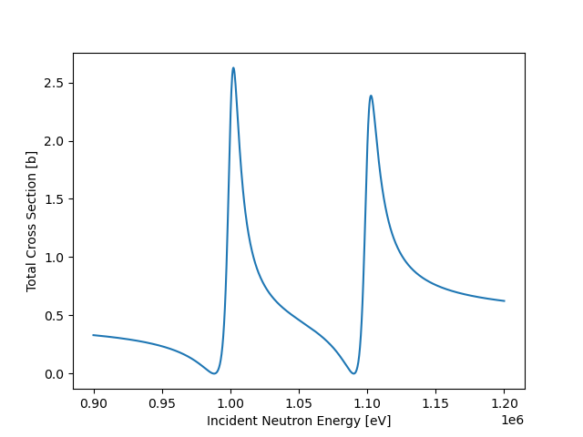
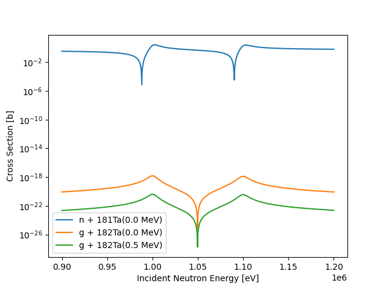

# rmatrix
package for solving full R-matrix equations


## installation

move into the `rmatrix` directory and run

```bash
pip install .
```

to install the package.

To install in editable mode, run

```bash
pip install -e .
```

### run the tests

inside the `rmatrix` directory, run

```bash
pytest
```

to run all of the tests in the `tests` directory

## using the rmatrix package

This example is given in the docs directory, in the [example.ipynb](docs/example.ipynb) file.

The particles need to be defined first:

```python
from rmaxtrix import Particles

neutron = Particle('n',1,0)
gamma = Particle('g',0,0)

target = Particle("181Ta",181,73)
compound = Particle("182Ta", 182,73, Sn='6.6e6')
```

A single elastic channel is defined:

```python
J = 3
pi = 1  # positivie parity
ell = 0  # only s-waves are implemented right now
radius = 0.2   # *10^(-12) cm 
reduced_width_aplitudes = [106.78913185, 108.99600881]

elastic = ElasticChannel(neutron, target,J,pi,ell,radius,reduced_width_aplitudes)

```

A capture channel to the ground state of the product nucleus is defined:

```python
J = 3
pi = 1  # positive parity
ell = 1 # orbital ang. momentum of the outgoing primary gamma
radius = 0.2   # *10^(-12) cm 
reduced_width_aplitudes = [2.51487027e-06, 2.49890268e-06]
excitation = 0  # the product is left in the ground state 

capture_ground = CaptureChannel(gamma,compound,J,pi,ell,radius,reduced_width_aplitudes, excitation)
```

and a capture channel to the 1st excited state, at 0.5 MeV, is defined (for this simple example, the widths are just scaled from the ground state channel):

```python
J = 3
pi = 1  # positive parity
ell = 2 # orbital ang. momentum of the outgoing primary gamma
radius = 0.2   # *10^(-12) cm 
reduced_width_aplitudes = 0.8*capture_ground.reduced_width_aplitudes
excitation = 5e5  # the product is left in the 1st ex state at 0.5MeV

capture_first = CaptureChannel(gamma,compound,J,pi,ell,radius,reduced_width_aplitudes, excitation)
```

Currently, the main object is the `SpinGroup` object, which holds all of the channels for a single spin group.

It requires resonance energies, a neutron grid, and the channels

```python
res_energies = [1e6,1.1e6]
energy_grid = np.linspace(0.9e6,1.2e6,1001)

sg = SpinGroup(res_energies, elastic, [capture_ground, capture_first],energy_grid)
```

The spin group object will calculate the total cross section and the cross sections for each channel upon initialization.

```python
plt.plot(sg.energy_grid, sg.total_cross_section)
plt.ylabel("Total Cross Section [b]")
plt.xlabel("Incident Neutron Energy [eV]")
```



The channel cross sections can be accessed through the `channels` attribute:

```python
for channel in sg.channels:
    plt.plot(sg.energy_grid, channel.cross_section, label=channel)

plt.legend()
plt.ylabel("Cross Section [b]")
plt.xlabel("Incident Neutron Energy [eV]")
plt.yscale("log")
```




## modify the gamma matrix

once the spin group object has been created, the gamma matrix can be manually changed using the `update_gamma_matrix()` method. it will update the rest of the matrices and calculate new cross sections

```python
new_sg = deepcopy(sg)

new_gamma_matrix = 0.5 * sg.gamma_matrix

new_sg.update_gamma_matrix(new_gamma_matrix)
```
